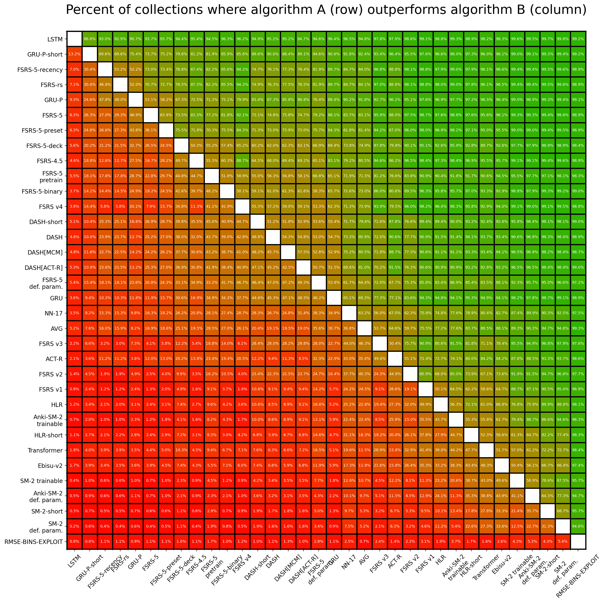
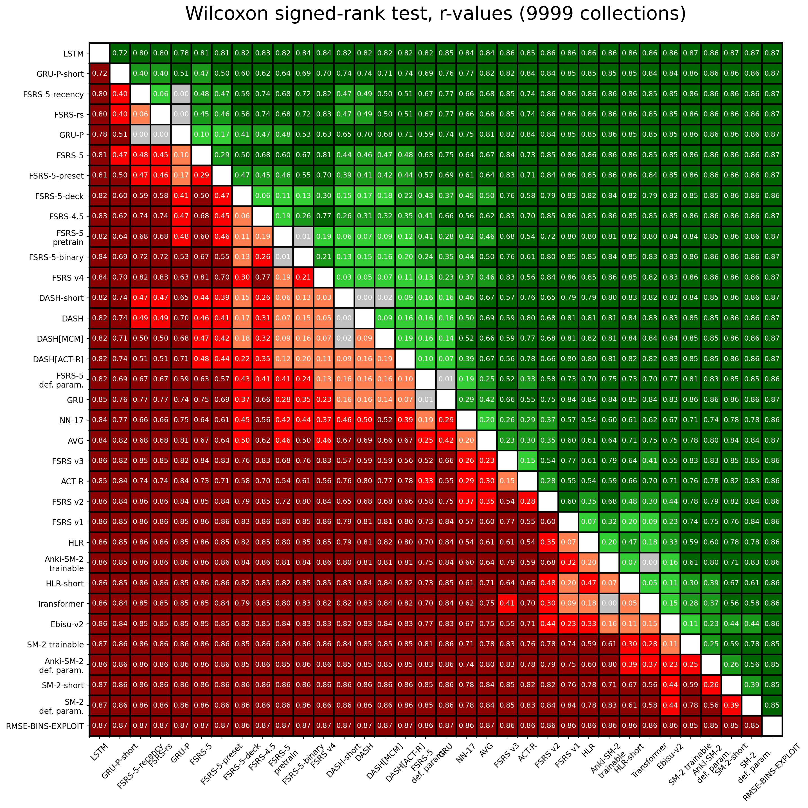
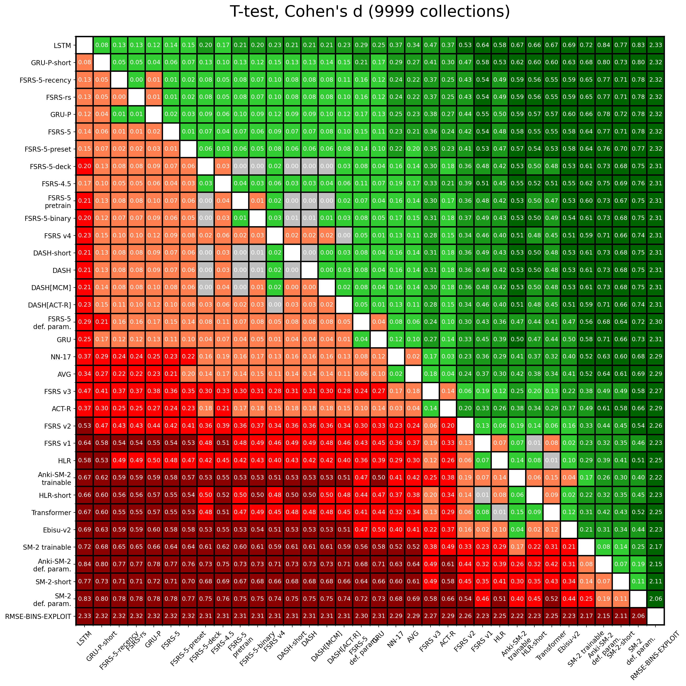

# SRS Benchmark

## Introduction

Spaced repetition algorithms are computer programs designed to help people schedule reviews of flashcards. A good spaced repetition algorithm helps you remember things more efficiently. Instead of cramming all at once, it distributes your reviews over time. To make this efficient, these algorithms try to understand how your memory works. They aim to predict when you're likely to forget something, so they can schedule a review accordingly.

This benchmark is a tool designed to assess the predictive accuracy of various algorithms. A multitude of algorithms are evaluated to find out which ones provide the most accurate predictions.

## Dataset

~~The dataset for the SRS benchmark comes from 20 thousand people who use Anki, a flashcard app. In total, this dataset contains information about \~1.7 billion reviews of flashcards. The full dataset is hosted on Hugging Face Datasets: [open-spaced-repetition/FSRS-Anki-20k](https://huggingface.co/datasets/open-spaced-repetition/FSRS-Anki-20k).~~

The dataset for the SRS benchmark comes from 10 thousand users who use Anki, a flashcard app. In total, this dataset contains information about ~727 million reviews of flashcards. The full dataset is hosted on Hugging Face Datasets: [open-spaced-repetition/anki-revlogs-10k](https://huggingface.co/datasets/open-spaced-repetition/anki-revlogs-10k).

## Evaluation

### Data Split

In the SRS benchmark, we use a tool called `TimeSeriesSplit`. This is part of the [sklearn](https://scikit-learn.org/) library used for machine learning. The tool helps us split the data by time: older reviews are used for training and newer reviews for testing. That way, we don't accidentally cheat by giving the algorithm future information it shouldn't have. In practice, we use past study sessions to predict future ones. This makes `TimeSeriesSplit` a good fit for our benchmark.

Note: TimeSeriesSplit will remove the first split from evaluation. This is because the first split is used for training, and we don't want to evaluate the algorithm on the same data it was trained on.

### Metrics

We use three metrics in the SRS benchmark to evaluate how well these algorithms work: log loss, AUC, and a custom RMSE that we call RMSE (bins).

- Log Loss (also known as Binary Cross Entropy): Utilized primarily for its applicability in binary classification problems, log loss serves as a measure of the discrepancies between predicted probabilities of recall and review outcomes (1 or 0). It quantifies how well the algorithm approximates the true recall probabilities, making it an important metric for algorithm evaluation in spaced repetition systems. Log Loss ranges from 0 to infinity, lower is better.
- AUC (Area under the ROC Curve): AUC represents the degree or measure of separability. It tells how much the algorithm is capable of distinguishing between classes. AUC ranges from 0 to 1, however, in practice it's almost always greater than 0.5; higher is better.
- Root Mean Square Error in Bins (RMSE (bins)): This is a metric designed for use in the SRS benchmark. In this approach, predictions and review outcomes are grouped into bins based on three features: the interval length, the number of reviews, and the number of lapses. Within each bin, the squared difference between the average predicted probability of recall and the average recall rate is calculated. These values are then weighted according to the sample size in each bin, and then the final weighted root mean square error is calculated. This metric provides a nuanced understanding of algorithm performance across different probability ranges. For more details, you can read [The Metric](https://github.com/open-spaced-repetition/fsrs4anki/wiki/The-Metric). RMSE (bins) ranges from 0 to 1, lower is better.

### Algorithms

- FSRS v3: the first version of the FSRS algorithm that people actually used.
- FSRS v4: the upgraded version of FSRS, made better with help from the community.
- FSRS-4.5: the minorly improved version based on FSRS v4. The shape of the forgetting curve has been changed.
- FSRS-5: the latest version of FSRS. Unlike the previous versions, it uses the same-day review data. Same-day reviews are used only for training, and not for evaluation.
    - FSRS-5 default param.: FSRS-5 with default parameters (which have been obtained by running FSRS-5 on all 20 thousand collections).
    - FSRS-5 pretrain: FSRS-5 where only the first 4 parameters (values of initial stability after the first review) are optimized and the rest are set to default.
    - FSRS-5 binary: FSRS which treats `hard` and `easy` ratings as `good`.
- FSRS-rs: the Rust port of FSRS-5. See also: https://github.com/open-spaced-repetition/fsrs-rs
- GRU: a type of neural network that's often used for making predictions based on a sequence of data. It's a classic in the field of machine learning for time-related tasks.
    - GRU-P: a variant of GRU that removes the forgetting curve and predicts the probability of recall directly.
- DASH: the model proposed in [this paper](https://scholar.colorado.edu/concern/graduate_thesis_or_dissertations/zp38wc97m). The name stands for Difficulty, Ability, and Study History. In our benchmark, we only use the Ability and Study History because the Difficulty part is not applicable to our dataset. We also added two other variants of this model: DASH[MCM] and DASH[ACT-R]. For further information, please refer to [this paper](https://www.politesi.polimi.it/retrieve/b39227dd-0963-40f2-a44b-624f205cb224/2022_4_Randazzo_01.pdf).
- ACT-R: the model proposed in [this paper](http://act-r.psy.cmu.edu/wordpress/wp-content/themes/ACT-R/workshops/2003/proceedings/46.pdf). It includes an activation-based system of declarative memory. It explains the spacing effect by the activation of memory traces.
- HLR: the model proposed by Duolingo. Its full name is Half-Life Regression. For further information, please refer to the [this paper](https://github.com/duolingo/halflife-regression).
- Transformer: a type of neural network that has gained popularity in recent years due to its superior performance in natural language processing. ChatGPT is based on this architecture. Both GRU and Transformer use the same power forgetting curve as FSRS-4.5 and FSRS-5 to make the comparison more fair.
- SM-2: one of the early algorithms used by SuperMemo, the first spaced repetition software. It was developed more than 30 years ago, and it's still popular today. [Anki's default algorithm is based on SM-2](https://faqs.ankiweb.net/what-spaced-repetition-algorithm.html), [Mnemosyne](https://mnemosyne-proj.org/principles.php) also uses it. This algorithm does not predict the probability of recall natively; therefore, for the sake of the benchmark, the output was modified based on some assumptions about the forgetting curve.
- NN-17: a neural network approximation of [SM-17](https://supermemo.guru/wiki/Algorithm_SM-17). It has a comparable number of parameters, and according to our estimates, it performs similarly to SM-17.
- Ebisu v2: [an algorithm that uses Bayesian statistics](https://fasiha.github.io/ebisu/) to update its estimate of memory half-life after every review.
- AVG: an "algorithm" that outputs a constant equal to the user's average retention. Has no practical applications and is intended only to serve as a baseline.

If an algorithm has "-short" at the end of its name, it means that it uses data from same-day reviews as well.

For further information regarding the FSRS algorithm, please refer to the following wiki page: [The Algorithm](https://github.com/open-spaced-repetition/fsrs4anki/wiki/The-Algorithm).

## Result

Total number of users: 9,999.

Total number of reviews for evaluation: 349,923,850.
Same-day reviews are excluded except when optimizing FSRS-5 and algorithms that have "-short" at the end of their names. Each algorithm uses only one review per day (the first, chronologically). Some reviews are filtered out, for example, the revlog entries created by changing the due date manually or reviewing cards in a filtered deck with "Reschedule cards based on my answers in this deck" disabled. Finally, an outlier filter is applied. These are the reasons why the number of reviews used for evaluation is significantly lower than the figure of 727 million mentioned earlier. 

The following tables present the means and the 99% confidence intervals. The best result is highlighted in **bold**. The rightmost column shows the number of optimizable (trainable) parameters. If a parameter is a constant, it is not included.

### Weighted by the number of reviews

| Model | Parameters | LogLoss | RMSE (bins) | AUC |
| --- | --- | --- | --- | --- |
| **GRU-P-short** | 297 | **0.320±0.0080** | **0.042±0.0013** | **0.710±0.0047** |
| GRU-P | 297 | 0.325±0.0081 | 0.043±0.0013 | 0.699±0.0046 |
| FSRS-5 | 19 | 0.327±0.0083 | 0.051±0.0015 | 0.701±0.0044 |
| FSRS-rs | 19 | 0.327±0.0081 | 0.051±0.0015 | 0.701±0.0043 |
| FSRS-4.5 | 17 | 0.332±0.0083 | 0.054±0.0016 | 0.692±0.0041 |
| FSRS-5 binary | 15 | 0.334±0.0082 | 0.056±0.0016 | 0.679±0.0047 |
| FSRS v4 | 17 | 0.338±0.0086 | 0.058±0.0017 | 0.689±0.0043 |
| DASH | 9 | 0.340±0.0086 | 0.063±0.0017 | 0.639±0.0046 |
| GRU | 39 | 0.343±0.0088 | 0.063±0.0017 | 0.673±0.0039 |
| DASH[MCM] | 9 | 0.340±0.0085 | 0.064±0.0018 | 0.640±0.0051 |
| DASH-short | 9 | 0.339±0.0084 | 0.066±0.0019 | 0.636±0.0050 |
| DASH[ACT-R] | 5 | 0.343±0.0087 | 0.067±0.0019 | 0.629±0.0049 |
| FSRS-5 pretrain | 4 | 0.344±0.0085 | 0.072±0.0022 | 0.690±0.0040 |
| FSRS v3 | 13 | 0.371±0.0099 | 0.073±0.0021 | 0.667±0.0047 |
| FSRS-5 default param. | 0 | 0.353±0.0089 | 0.081±0.0025 | 0.686±0.0040 |
| NN-17 | 39 | 0.38±0.027 | 0.081±0.0038 | 0.611±0.0043 |
| ACT-R | 5 | 0.362±0.0089 | 0.086±0.0024 | 0.534±0.0054 |
| AVG | 0 | 0.363±0.0090 | 0.088±0.0025 | 0.508±0.0046 |
| HLR | 3 | 0.41±0.012 | 0.105±0.0030 | 0.633±0.0050 |
| HLR-short | 3 | 0.44±0.013 | 0.116±0.0036 | 0.615±0.0062 |
| SM-2-short | 0 | 0.51±0.015 | 0.128±0.0038 | 0.593±0.0064 |
| SM-2 | 0 | 0.55±0.017 | 0.148±0.0041 | 0.600±0.0051 |
| Ebisu-v2 | 0 | 0.46±0.012 | 0.158±0.0038 | 0.594±0.0050 |
| Transformer | 127 | 0.45±0.012 | 0.166±0.0049 | 0.519±0.0065 |

### Unweighted

| Model | Parameters | Log Loss | RMSE (bins) | AUC |
| --- | --- | --- | --- | --- |
| **GRU-P-short** | 297 | **0.346±0.0042** | **0.062±0.0011** | **0.699±0.0026** |
| GRU-P | 297 | 0.352±0.0042 | 0.063±0.0011 | 0.687±0.0025 |
| FSRS-5 | 19 | 0.356±0.0044 | 0.073±0.0012 | 0.699±0.0023 |
| FSRS-rs | 19 | 0.356±0.0044 | 0.073±0.0012 | 0.699±0.0023 |
| FSRS-4.5 | 17 | 0.362±0.0045 | 0.076±0.0013 | 0.689±0.0023 |
| FSRS-5 binary | 15 | 0.366±0.0044 | 0.080±0.0013 | 0.672±0.0025 |
| DASH | 9 | 0.368±0.0045 | 0.084±0.0013 | 0.631±0.0027 |
| FSRS v4 | 17 | 0.373±0.0048 | 0.084±0.0014 | 0.685±0.0023 |
| DASH-short | 9 | 0.368±0.0045 | 0.086±0.0014 | 0.622±0.0029 |
| DASH[MCM] | 9 | 0.369±0.0044 | 0.086±0.0014 | 0.634±0.0026 |
| GRU | 39 | 0.375±0.0047 | 0.086±0.0014 | 0.668±0.0023 |
| FSRS-5 pretrain | 4 | 0.369±0.0046 | 0.088±0.0013 | 0.694±0.0023 |
| DASH[ACT-R] | 5 | 0.373±0.0047 | 0.089±0.0016 | 0.624±0.0027 |
| NN-17 | 39 | 0.398±0.0049 | 0.101±0.0013 | 0.624±0.0023 |
| FSRS-5 default param. | 0 | 0.383±0.0049 | 0.103±0.0016 | 0.693±0.0022 |
| AVG | 0 | 0.394±0.0050 | 0.103±0.0016 | 0.500±0.0026 |
| ACT-R | 5 | 0.403±0.0055 | 0.107±0.0017 | 0.522±0.0024 |
| FSRS v3 | 13 | 0.436±0.0067 | 0.110±0.0020 | 0.661±0.0024 |
| HLR | 3 | 0.469±0.0073 | 0.128±0.0019 | 0.637±0.0026 |
| HLR-short | 3 | 0.493±0.0079 | 0.140±0.0021 | 0.611±0.0029 |
| Ebisu-v2 | 0 | 0.499±0.0078 | 0.163±0.0021 | 0.605±0.0026 |
| Transformer | 127 | 0.468±0.0059 | 0.167±0.0022 | 0.531±0.0030 |
| SM-2-short | 0 | 0.65±0.015 | 0.170±0.0028 | 0.590±0.0027 |
| SM-2 | 0 | 0.72±0.017 | 0.203±0.0030 | 0.603±0.0025 |

Averages weighted by the number of reviews are more representative of "best case" performance when plenty of data is available. Since almost all algorithms perform better when there's a lot of data to learn from, weighting by n(reviews) biases the average towards lower values.

Unweighted averages are more representative of "average case" performance. In reality, not every user will have hundreds of thousands of reviews, so the algorithm won't always be able to reach its full potential.

### Superiority

The metrics presented above can be difficult to interpret. In order to make it easier to understand how algorithms perform relative to each other, the image below shows the percentage of users for whom algorithm A (row) has a lower RMSE than algorithm B (column). For example, GRU-P-short has a 95.9% superiority over the Transformer, meaning that for 95.9% of all collections in this benchmark, GRU-P-short can estimate the probability of recall more accurately than the Transformer. This is based on 9,999 collections.



You may have noticed that FSRS-5 has a 99.0% superiority over SM-2, meaning that for 99.0% of users, RMSE will be lower with FSRS-5 than with SM-2. But please remember that SM-2 wasn’t designed to predict probabilities, and the only reason it does that in this benchmark is because extra formulas were added to it.

### Statistical significance

The figures below show two different measures of effect size comparing the RMSE between all pairs of algorithms:

1. Wilcoxon signed-rank test r-values (effect sizes)
2. Paired t-test Cohen's d values (effect sizes)

For both visualizations, the colors indicate:

- Red shades indicate the row algorithm performs worse than the column algorithm:
  - Dark red: large effect (r > 0.5 or d > 0.5)
  - Red: medium effect (0.5 ≥ r > 0.2 or 0.5 ≥ d > 0.2) 
  - Light red: small effect (r ≤ 0.2 or d ≤ 0.2)

- Green shades indicate the row algorithm performs better than the column algorithm:
  - Dark green: large effect (r > 0.5 or d > 0.5)
  - Green: medium effect (0.5 ≥ r > 0.2 or 0.5 ≥ d > 0.2) 
  - Light green: small effect (r ≤ 0.2 or d ≤ 0.2)

- Grey indicates that the p-value is greater than 0.01, meaning we cannot conclude which algorithm performs better.

The Wilcoxon test is non-parametric and considers both the sign and rank of differences between pairs, while the t-test assumes normality and provides Cohen's d as a standardized measure of the difference between means. Both tests are paired, comparing algorithms' performance on the same collections, but do not account for the varying number of reviews across collections. Therefore, while the test results are reliable for qualitative analysis, caution should be exercised when interpreting the specific magnitude of effects.




Note: You may notice that the two tests don't completely agree on which algorithms are better or worse. This is because the Wilcoxon test only considers the sign and rank of differences, while the t-test considers not only the sign and rank but also the magnitude of differences.

## Default Parameters

FSRS-5:

```
0.40255, 1.18385, 3.173, 15.69105,
7.1949, 0.5345, 1.4604, 0.0046,
1.54575, 0.1192, 1.01925,
1.9395, 0.11, 0.29605, 2.2698,
0.2315, 2.9898,
0.51655, 0.6621
```

## Comparisons with SuperMemo 15/16/17

Please refer to the following repositories:
- [fsrs-vs-sm15](https://github.com/open-spaced-repetition/fsrs-vs-sm15)
- [fsrs-vs-sm17](https://github.com/open-spaced-repetition/fsrs-vs-sm17)


## How to run the benchmark

### Requirements

Dataset (tiny): https://github.com/open-spaced-repetition/fsrs-benchmark/issues/28#issuecomment-1876196288

Dependencies:

```bash
pip install -r requirements.txt
```

### Commands

FSRS-5:

```bash
python script.py
```

FSRS-5 with default parameters:

```bash
python script.py --dry
```

FSRS-5 with only the first 4 parameters optimized:

```bash
python script.py --pretrain
```

FSRS-rs:

It requires `fsrs_rs_python` to be installed.

```bash
pip install fsrs_rs_python
```

Then run the following command:

```bash
python script.py --rust
```

Dev model in fsrs-optimizer:

```bash
python script.py --dev
```

> Please place the [fsrs-optimizer repository](https://github.com/open-spaced-repetition/fsrs-optimizer) in the same directory as this repository.

Set the number of threads:

```bash
python script.py --threads 4
```

Save the raw predictions:

```bash
python script.py --raw
```

Save the detailed results:

```bash
python script.py --file
```

Save the analyzing charts:

```bash
python script.py --plot
```

Benchmark FSRSv4/FSRSv3/HLR/LSTM/SM2:

```bash
python other.py --model FSRSv4
```

> Please change the `--model` argument to `FSRSv3`, `HLR`, `GRU`, or `SM2` to run the corresponding model.
